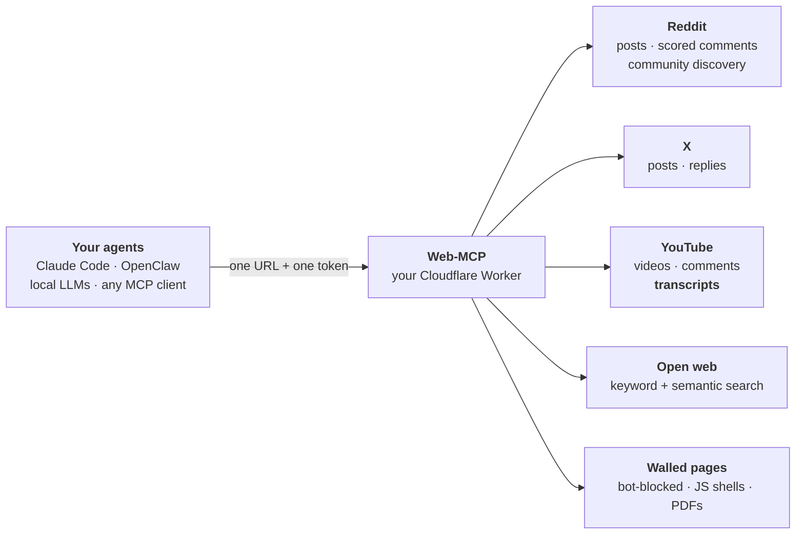
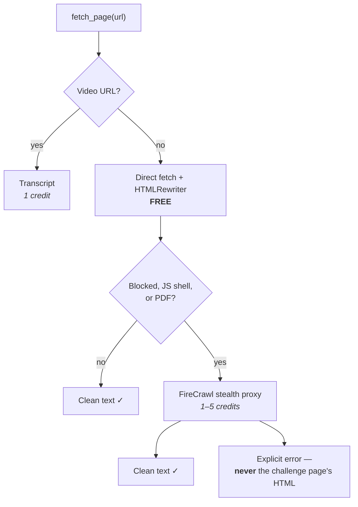
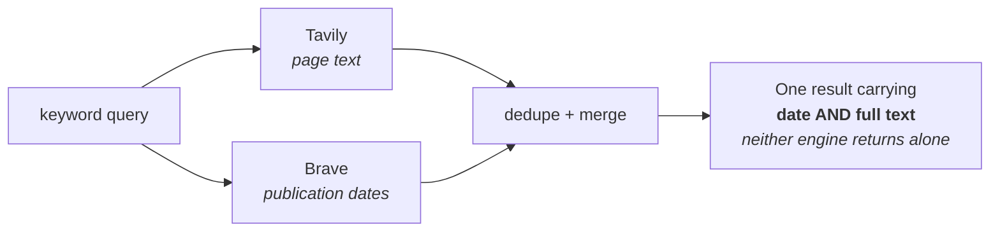

# Web-MCP

### Give any AI agent the parts of the web it can't reach.

[](https://workers.cloudflare.com/)
[](https://www.typescriptlang.org/)
[](https://modelcontextprotocol.io/)
[](LICENSE)

Reddit and X block LLM traffic. Ordinary pages sit behind Cloudflare challenges. Search returns the marketing layer while the real answers sit in comment threads. A video's content is locked in its audio. And a local model with no search tool can't look up anything at all.

**One endpoint fixes all of it.** Deploy once to your own Cloudflare account, register one URL and one token, and every agent session gets the same reach.



---

## What it actually gets you

Ask *"what's the best local video model right now?"* — a question no search engine answers honestly:

| Step | Tool | What comes back |
|---|---|---|
| 1 | `find_communities` | r/StableDiffusion (986k), r/LocalLLaMA (792k) |
| 2 | `social_search` | The threads practitioners wrote **this week** |
| 3 | `get_thread` | *"Minimum for 480p is a 3060 with 12GB… ~9 minutes"* — from the ComfyUI lead, plus 193 comments of dissent |
| 4 | `fetch_page` | The vendor's benchmark page that returns 403 to everyone else |
| 5 | `fetch_page` on a video | The **spoken transcript** of the tutorial |

That's information that doesn't exist in any search index, and none of it needed a browser.

---

## Start free — three keys, no card, most of the capability

These three cost **nothing**, ever:

| Provider | Unlocks | Free allowance |
|---|---|---|
| **Reddit** | Post search, scored comment trees, subreddit discovery | Unlimited (1,000 req/10min) |
| **YouTube** | Video search, comments, view/like signals | ~100 searches/day |
| **Tavily** | Keyword web search — everyday lookups | 1,000 credits/month |

**Stop there and you already have:** community discovery · Reddit + YouTube search with engagement signals · full scored comment threads · keyword web search · and page fetching for every site that isn't actively blocking you.

That's four of the five tools working, for £0.

### Then add what you actually need

| Provider | Unlocks | Cost |
|---|---|---|
| **FireCrawl** | Reads bot-protected pages and PDFs | 1–5 credits, **only when blocked** |
| **Supadata** | Video transcripts (YouTube, TikTok, Instagram, X) | 1 credit each |
| **Exa** | Semantic search — finds pages whose keywords you can't guess, plus find-similar | ~$0.007/call |
| **TwitterAPI.io** | X search and reply threads | ~$0.15/1k tweets |
| **Brave** | Keyword search with an independent index + publication dates | ~$5/1k, no free tier |

**`MCP_AUTH_TOKEN` is the only required secret.** Every source is independent, and the server **only advertises tools whose providers are configured** — your agent is never offered something it can't use, and never discovers that by failing.

---

## The tools

**Reach the discussion** — where practitioners actually talk

| Tool | |
|---|---|
| `social_search` | Search Reddit, X and YouTube together. Returns engagement signals — scores, views, comment counts, authors, dates — so you can weigh consensus yourself |
| `get_thread` | The full scored comment tree. High-voted *dissent* is often the most valuable thing on the page |
| `find_communities` | Which subreddits own a topic. Scoping a search is the single biggest quality lever |

**Reach the page** — anything that blocks you

| Tool | |
|---|---|
| `fetch_page` | Bot-protected pages, JavaScript shells, PDFs, and video transcripts. Free direct fetch first; paid escalation only on a genuine wall |

**Reach the open web** — for everything else

| Tool | |
|---|---|
| `web_search` | `keyword` mode for factual lookups; `semantic` mode for *"essays arguing against microservices"* — pages that never use those words |

Five tools. No LLM inside the worker, no ranking, no summarising — raw signals go straight to the calling model, which does the thinking. Sprawling tool surfaces bloat context windows and confuse routing.

---

## How it works

### `fetch_page` escalates — free first, paid only when necessary



That last box matters more than it looks. The common failure mode elsewhere is an agent confidently summarising a Cloudflare interstitial it mistook for content. Web-MCP tells you it failed.

### Keyword search can merge two independent engines



Their indexes are largely disjoint, so recall roughly doubles. Every result lists which `engines` found it — cross-index agreement is handed to your model as a signal, not baked into a ranking here.

Everything is cached in KV and every paid provider has a daily spend ceiling that fails with a readable message rather than a surprise bill.

> Extending it, or want the reasoning behind the design? **[ARCHITECTURE.md](ARCHITECTURE.md)** covers the principles, how to add a provider, and the per-provider gotchas that aren't in any vendor's docs.

---

## Setup

**1. Generate your token** — the only credential your clients need.

```bash
echo "webmcp_$(openssl rand 32 | base64 | tr '+/' '-_' | tr -d '=\n')"
```

**2. Grab the provider keys you want** (all optional):

<details>
<summary><b>Reddit</b> — free, ~2 minutes</summary>

At [reddit.com/prefs/apps](https://www.reddit.com/prefs/apps): **create another app…** → type **script** → redirect URI `http://localhost` (unused). Copy the **client ID** (under the app name) and **secret**.

Set `REDDIT_USER_AGENT` in `wrangler.toml` to identify your app — e.g. `cf-worker:web-mcp:v1 (by /u/yourusername)`. Reddit requires a unique, descriptive UA.
</details>

<details>
<summary><b>YouTube</b> — free</summary>

[console.cloud.google.com](https://console.cloud.google.com) → create/pick a project → **APIs & Services → Library → "YouTube Data API v3" → Enable** → **Credentials → Create Credentials → API key**.

*Empty API-restrictions dropdown? The API isn't enabled on that project yet — the dropdown only lists enabled APIs.*

Quota: search costs ~100× more than metadata or comments, so only search is scarce and only search is budgeted here.
</details>

<details>
<summary><b>Keyword search</b> — Tavily and/or Brave</summary>

**Configure this if your MCP client has no web search of its own** (a local LLM, for instance).

- **[Tavily](https://app.tavily.com)** — 1,000 credits/month free, native domain filters, full page text, no publication dates
- **[Brave](https://api-dashboard.search.brave.com)** — independent index, publication dates, no free tier since Feb 2026

`KEYWORD_SEARCH_PROVIDER` = `auto` | `tavily` | `brave` | `both`. **Defaults to `both`** (parallel + merged). For free-tier-only running, set it to `auto`.
</details>

<details>
<summary><b>Semantic search</b> — Exa</summary>

[dashboard.exa.ai](https://dashboard.exa.ai). Matches meaning, not keywords — and does find-similar-by-URL, which nothing else here can do.

Complementary to keyword search, not a replacement: semantic is measurably weaker at plain factual lookups.
</details>

<details>
<summary><b>X</b> — TwitterAPI.io</summary>

[twitterapi.io](https://twitterapi.io/) — instant key, no X developer approval, ~$0.15/1k tweets. A small free allowance lets you test, throttled to 1 request/5s until you add credits.
</details>

<details>
<summary><b>Bot-protected pages</b> — FireCrawl</summary>

[firecrawl.dev](https://firecrawl.dev). `fetch_page` works without it on open pages — it only escalates at a genuine wall. 1 credit, up to 5 with the enhanced proxy.
</details>

<details>
<summary><b>Video transcripts</b> — Supadata</summary>

[supadata.ai](https://supadata.ai), 100/month free. Required because the official YouTube API *cannot* return transcripts: `captions.download` needs the video owner's OAuth, and auto-generated captions aren't exposed at all.
</details>

**3. Run locally** (optional):

```bash
npm install
cp .env.example .dev.vars   # fill in whichever keys you have
npm run dev                 # http://localhost:8787/mcp
```

**4. Deploy:**

```bash
export CLOUDFLARE_ACCOUNT_ID=<your-account-id>   # npx wrangler whoami

npx wrangler kv namespace create KV
# paste the returned id into wrangler.toml

echo "<value>" | npx wrangler secret put MCP_AUTH_TOKEN   # required
# ...then one line per provider key you're using

npm run deploy
```

The free Workers plan covers personal use comfortably.

**5. Connect your client:**

The server is stateless Streamable HTTP — any MCP client works with just a URL and a header.

*Claude Code:*

```bash
claude mcp add --transport http --scope user web-mcp \
  https://web-mcp.<your-subdomain>.workers.dev/mcp \
  --header "Authorization: Bearer <MCP_AUTH_TOKEN>"
```

Restart afterwards — Claude Code loads MCP servers at startup.

*Jan, or any client with an "add MCP server" dialog:*

| Field | Value |
|---|---|
| Transport | **HTTP** (Streamable HTTP) |
| URL | `https://web-mcp.<your-subdomain>.workers.dev/mcp` |
| Header name | `Authorization` |
| Header value | `Bearer <MCP_AUTH_TOKEN>` |

Leave Command / Args / Env empty — those are for stdio servers.

The server speaks both halves of Streamable HTTP: plain JSON responses, or SSE when your client asks for `text/event-stream` (including the `GET` stream clients open for server-initiated messages). Long-running calls emit keepalive heartbeats, so transcripts and bot-protection escalations won't trip your client's idle timeout.

*Clients that only speak stdio* can bridge with [`mcp-remote`](https://github.com/geelen/mcp-remote): command `npx`, args `-y mcp-remote <url> --header Authorization:${AUTH_HEADER}`, and `AUTH_HEADER=Bearer <token>` in env. The colon has no space after it deliberately — several clients mangle spaces inside args when invoking npx.

---

## Good to know

- **Search technique matters.** Reddit, X and YouTube match keywords, not meaning — a natural-language question silently degrades into "merely popular posts". Short keyword queries win, and scoping to a subreddit is the biggest lever. The tool descriptions teach your model this, so you don't have to.
- **Transcripts** cost 1 credit using existing captions. `generate: true` transcribes audio instead, billed **per minute** — a 60-minute talk ≈ 120 credits. Opt-in only.
- **TwitterAPI.io is third-party** — ~30× cheaper than the official X API, but grey-market. `src/providers/` is abstracted, so swapping is contained.
- **Privacy.** Single-user by design: one shared token, no accounts. Don't publish your worker URL and token together.

## Roadmap

**Discord** — searching servers you're a member of. There's no read API for it and datacenter IPs are blocked, so it likely needs a small local companion process rather than a worker provider. Same MCP pattern, different host.

Issues and ideas welcome.

## License

[MIT](LICENSE)
